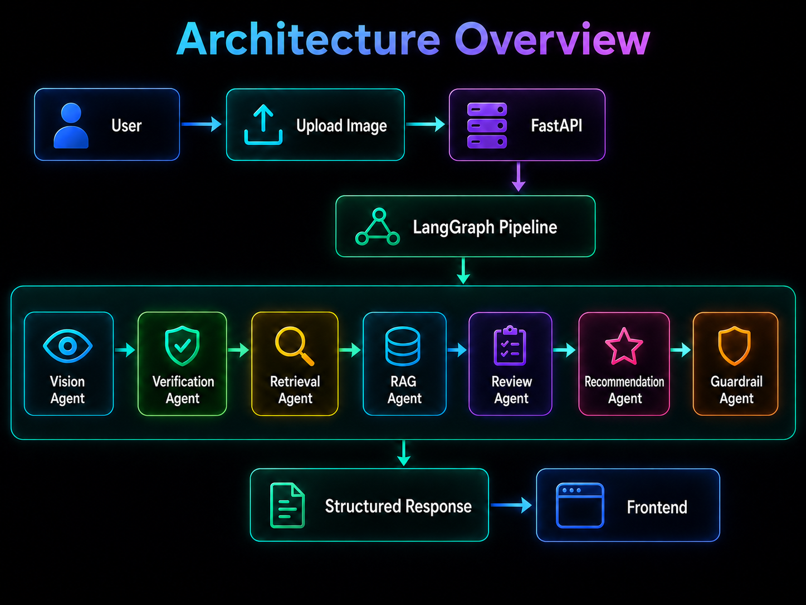
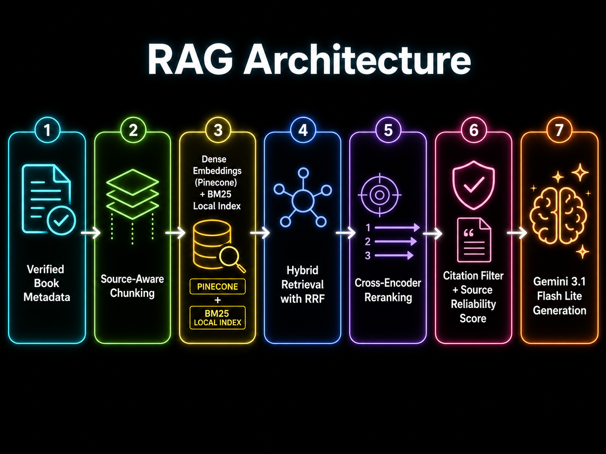

# Ledgera – Multimodal Agentic Book Reviewer

AI-powered book analysis from cover images. Upload or snap a photo of any book cover and receive an instant spoiler-free review, confidence score, citations, and a buy/borrow/skip recommendation.

## Features

- **Gemini Vision Cover Analysis** – Gemini 3.1 Flash Lite extracts title/author directly from cover images
- **Multi-Source Verification** – Google Books + Open Library API cross-validation
- **Hybrid RAG Pipeline** – Dense embeddings (MiniLM-L6-v2) + BM25 sparse retrieval with Reciprocal Rank Fusion
- **Cross-Encoder Reranking** – ms-marco-MiniLM for precision-focused document reranking
- **Spoiler-Free Reviews** – Gemini 3.1 Flash Lite generates safe, citation-backed summaries
- **Confidence Scoring** – Multi-component confidence (vision, verification, source, review quality)
- **Guardrail System** – Pydantic validation, source whitelisting, spoiler detection, hallucination checks
- **Prometheus Monitoring** – Latency, errors, confidence distribution, feedback metrics
- **Premium UI** – Dark/gold glassmorphism design with upload, camera, and animated results

## Architecture


### RAG Architecture


## Tech Stack

| Layer | Technology |
|-------|-----------|
| Frontend | HTML, CSS, JavaScript |
| Backend | FastAPI + Uvicorn |
| LLM | Gemini 3.1 Flash Lite |
| Agent Framework | LangGraph |
| Database | Supabase Postgres |
| Vector DB | Pinecone |
| Embeddings | sentence-transformers/all-MiniLM-L6-v2 |
| Reranker | cross-encoder/ms-marco-MiniLM-L-6-v2 |
| Vision | Gemini 3.1 Flash Lite (multimodal) |
| Search | DuckDuckGo Search (ddgs) |
| Monitoring | prometheus-client (Grafana Cloud compatible) |
| Deployment | Vercel (frontend) + Northflank (Docker backend) |

## Folder Structure

```
├── config.py                  # Centralized configuration
├── main.py                    # FastAPI entry point
├── requirements.txt           # Dependencies
├── Dockerfile                 # Docker build
├── frontend/
│   ├── index.html             # UI
│   ├── style.css              # Styles
│   ├── app.js                 # Client logic
│   └── header_bg.png          # Hero background
├── src/
│   ├── api/
│   │   ├── routes.py          # API endpoints
│   │   └── schemas.py         # Pydantic models
│   ├── agent/
│   │   ├── graph.py           # LangGraph pipeline
│   │   ├── state.py           # Agent state
│   │   └── nodes/             # 7 agent nodes (vision, verification, retrieval, rag, review, recommendation, guardrail)
│   ├── rag/
│   │   ├── embeddings.py      # Dense embeddings
│   │   ├── pinecone_store.py  # Vector operations
│   │   ├── bm25.py            # Sparse retrieval
│   │   ├── hybrid.py          # RRF fusion
│   │   └── reranker.py        # Cross-encoder
│   ├── database/
│   │   ├── client.py          # Supabase client
│   │   ├── operations.py      # CRUD operations
│   │   └── schema.sql         # DDL
│   ├── monitoring/
│   │   └── metrics.py         # Prometheus metrics
│   └── utils/
│       └── logging.py         # Structured logging
├── evals/
│   ├── eval_runner.py         # Eval orchestrator
│   ├── metrics.py             # Eval metrics
│   └── test_cases.json        # Test dataset
└── tests/                     # pytest suite
```

## Setup & Run

### Prerequisites

- Python 3.11+
- Google API key (for Gemini 3.1 Flash Lite)

### Installation

```bash
# Clone and enter project
cd "Ledgera - Agentic Book Reviewer"

# Create and activate virtual environment
python -m venv venv
venv\Scripts\activate        # Windows
# source venv/bin/activate   # macOS/Linux

# Install dependencies
pip install -r requirements.txt

# Configure environment
cp .env.example .env
# Edit .env with your API keys
```

### Run

```bash
python main.py
# Server starts at http://localhost:8000
```

### Run Tests

```bash
python -m pytest tests/ -v
```

### Run Evals

```bash
python -m evals.eval_runner
```

## API Endpoints

| Method | Endpoint | Description |
|--------|----------|-------------|
| POST | `/api/analyze-book` | Upload image, get full analysis |
| POST | `/api/feedback` | Submit helpful/not_helpful feedback |
| GET | `/api/health` | Health check |
| GET | `/metrics` | Prometheus metrics |

## Eval Metrics

- Book identification accuracy
- Title/Author F1 score
- Retrieval precision@k
- Citation coverage
- Hallucination rate
- Recommendation agreement
- p50/p95 latency
- End-to-end success rate

## Deployment

### Frontend (Vercel)
Deploy the `frontend/` directory to Vercel. Update API base URL in `app.js`.

### Backend (Northflank)
Build and deploy using the included `Dockerfile`:
```bash
docker build -t ledgera .
docker run -p 8000:8000 --env-file .env ledgera
```

## Author

Sujato Dutta
AI Engineer | Researcher 

## License

MIT License. See LICENSE for details.

